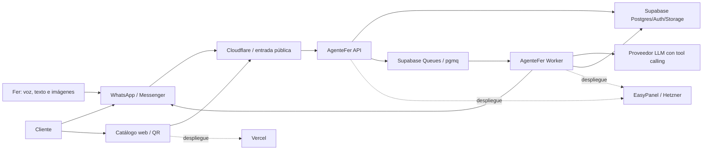
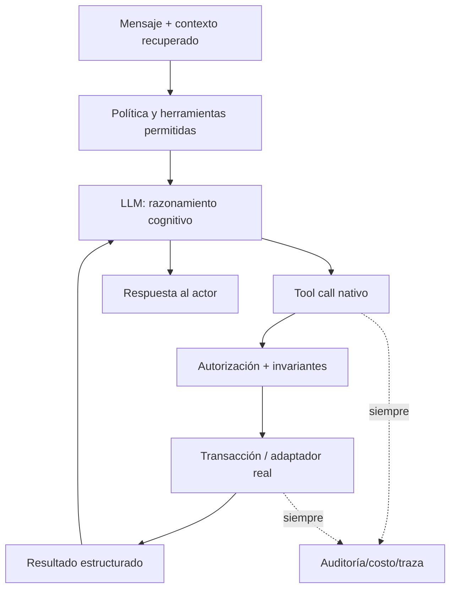

# AgenteFer — contexto y límites de arquitectura

Estado: arquitectura lógica con baseline técnico ratificado; las capacidades de cuentas externas todavía requieren prueba real antes de implementación.

## 1. Resultado del producto

AgenteFer es un sistema asistido por LLM para que Fer administre por voz/texto/imagen:

- catálogo, variantes, precios, stock y fotografías;
- atención entrante de WhatsApp y Messenger;
- calificación, cierre o handoff de clientes;
- catálogo web/QR y solicitudes de pedido;
- publicaciones autorizadas de una Página de Facebook;
- pendientes, reportes y configuración comercial.

El LLM interpreta, conversa y selecciona herramientas. Los servicios deterministas autentican, validan, autorizan, ejecutan transacciones, controlan estados y auditan.

## 2. Frontera de sistemas

### Dentro de AgenteFer

- Código del repositorio `frankzuuia/agentefer`.
- Aplicación web pública y administrativa.
- API de ingreso, comandos y pedidos.
- Worker de IA, medios, publicaciones, notificaciones y tareas programadas.
- Esquema, migraciones, funciones, RLS y buckets del proyecto Supabase de AgenteFer.
- Prompts, registro de herramientas, políticas, evaluaciones y observabilidad.

### Fuera de AgenteFer

- Todo repositorio, base, token, servicio, dominio o infraestructura que no esté registrado explícitamente como recurso de AgenteFer.
- Automatización de Marketplace no confirmada por APIs oficiales.
- Sistemas de pago, facturación o envíos hasta que se autoricen y especifiquen.

## 3. Entornos

| Entorno                    | Rama      | Supabase                             | EasyPanel                              | Web                 | Datos/secretos           |
| -------------------------- | --------- | ------------------------------------ | -------------------------------------- | ------------------- | ------------------------ |
| Desarrollo/staging inicial | `develop` | `AgenteFer` / `hprdctmblmfcoagugvyp` | `agente-fer`                           | pendiente           | exclusivos de staging    |
| Producción                 | `main`    | proyecto separado por crear          | proyecto/servicios separados por crear | producción separada | exclusivos de producción |

Reglas:

1. `develop` nunca despliega sobre recursos productivos.
2. Un secreto de staging no se reutiliza en producción.
3. La promoción usa artefacto/commit identificable y gates completos.
4. Producción no se crea hasta validar arquitectura, seguridad y flujo staging end-to-end.

## 4. Componentes lógicos

### 4.1 Web

Responsabilidades:

- catálogo público, galería, selector de variante/cantidad y precio aplicable;
- QR/enlaces compartibles;
- creación protegida de solicitud de pedido;
- administración accesible cuando se implemente;
- estados móvil, carga, vacío, error, permiso y accesibilidad.

No puede:

- contener claves privilegiadas;
- calcular como autoridad final precios/stock;
- cambiar catálogo o inventario sin sesión y autorización;
- llamar directamente a Meta con secretos.

### 4.2 API

Responsabilidades:

- endpoints de health/readiness;
- validación de webhooks y solicitudes públicas;
- normalización de eventos entrantes;
- autenticación/autorización del propietario y panel;
- creación idempotente de inbox, pedidos y trabajos;
- consultas seguras requeridas por web/admin;
- respuestas rápidas al proveedor para desacoplar trabajo pesado.

La API no debe ejecutar visión o conversaciones largas dentro del request del webhook.

### 4.3 Worker

Responsabilidades:

- consumir trabajos durables con lease/idempotencia;
- recuperar contexto y llamar al LLM;
- ejecutar tool calls autorizados;
- procesar medios con límites;
- enviar respuestas y notificaciones mediante adaptadores;
- ejecutar publicaciones/sincronizaciones programadas;
- registrar uso, costo, resultado y errores;
- conciliar trabajos atascados y dead letters.

### 4.4 Dominio

Módulos lógicos inicialmente requeridos:

- identidad, organización y membresía;
- conexiones/identidades de canal;
- conversación y mensajería;
- catálogo, categoría, producto, variante y atributos;
- medios y evidencia;
- libro de precios;
- inventario, reservas y movimientos;
- clientes, leads, oportunidades y handoff;
- pedidos, líneas y ventas;
- publicaciones, calendarios y trabajos;
- configuración comercial;
- auditoría, uso y observabilidad.

Los módulos se implementarán como límites de código dentro de un monorepo/modular monolith inicialmente; no se dividirán en microservicios sin evidencia de escala o aislamiento.

### 4.5 Adaptadores externos

- WhatsApp Cloud API: documentación oficial revisada; versión, credenciales, webhooks y permisos reales de AgenteFer se validan en B4.
- Messenger Platform: documentación oficial revisada; eventos, identidad, permisos y Página reales se validan en B4.
- Facebook Pages/Graph API: publicación de Página documentada; edición/ocultación y permisos exactos requieren capability matrix real. Marketplace continúa NO-BUILD.
- OpenAI y MiniMax: selección portable definida en ADR-010; API/modelo exactos requieren contratos y evals reales.
- Supabase: Postgres/Auth/Storage como plataforma; Queues/pgmq y Cron ratificados para cola/scheduler iniciales.
- Vercel/Cloudflare/EasyPanel: responsabilidades ratificadas en ADR-009; configuración concreta espera artefactos desplegables, dominio y recursos registrados.

## 5. Flujos principales

### 5.1 Mensaje entrante de cliente

1. Meta entrega webhook firmado.
2. API verifica autenticidad, frescura, tamaño e idempotencia.
3. API persiste evento/inbox y responde rápidamente a Meta.
4. Worker recupera identidad, conversación y publicación/producto de origen.
5. LLM razona sobre contexto y llama herramientas de consulta/acción permitidas.
6. Backend autoriza y ejecuta cada herramienta.
7. LLM redacta respuesta basada en resultados reales.
8. Adaptador envía dentro de política y registra ID/estado externo.

### 5.2 Comando de Fer

1. El mismo ingreso identifica una identidad de propietario vinculada.
2. Worker entrega al LLM contexto administrativo y herramientas del rol.
3. El LLM interpreta lenguaje natural/audio/imagen.
4. Si falta una decisión crítica, pregunta con candidatos identificables.
5. Si está completo, llama la herramienta correspondiente.
6. Backend aplica autorización, invariantes y transacción.
7. Fer recibe confirmación accesible y referencia auditada.

### 5.3 Foto a catálogo

1. Medio auténtico se descarga a un área controlada con límites y hash.
2. Se registra evidencia y se detecta duplicado.
3. Visión/LLM propone borrador y posibles coincidencias existentes.
4. Herramientas guardan propuesta; no activan campos críticos dudosos.
5. Fer resuelve preguntas como variante, cantidad del set, stock y precio.
6. Herramienta transaccional crea/actualiza producto, variante, SKU, precio, stock y galería.
7. Publicación requiere política/autorización separada.

### 5.4 Precio pendiente

1. Cliente pregunta por una oferta sin precio.
2. Agente obtiene cantidad/variante y crea tarea pendiente.
3. Fer recibe contexto y responde naturalmente.
4. Si la respuesta no identifica una sola pendiente, el agente presenta opciones.
5. Herramienta resuelve la tarea, actualiza catálogo solo si Fer lo ordenó y responde al cliente.

### 5.5 Catálogo a pedido

1. Cliente elige variante y cantidad.
2. Servidor recalcula precio y disponibilidad vigentes.
3. Se crea pedido idempotente con snapshot y, si aplica, reserva.
4. Se registra consentimiento/dato de contacto aportado.
5. Outbox genera notificación a Fer.
6. El pedido permanece pendiente hasta confirmación/cierre; no se contabiliza automáticamente como venta.

### 5.6 Publicación programada

1. Fer aprueba política/calendario o publicación concreta.
2. Scheduler genera trabajos deduplicados para variantes elegibles.
3. Worker revalida precio, stock, permisos, frecuencia y contenido al ejecutar.
4. Adaptador usa únicamente capacidad oficial disponible.
5. Se registra ID externo o error recuperable/terminal.
6. Cambios posteriores generan sincronización solo si la superficie lo soporta.

## 6. Principios de datos

- ID interno opaco e inmutable; SKU es identificador comercial único por organización.
- `organization_id` en todo dato operacional.
- Tiempo almacenado en UTC; presentación y reportes en zona configurada.
- Precios con moneda y unidad; nunca `float` binario para dinero.
- Ledger/movimientos para inventario y auditoría; no ocultar historia.
- Pedidos guardan snapshot para que cambios futuros no reescriban lo acordado.
- Eventos externos conservan ID del proveedor e idempotency key.
- Contenido multimedia conserva hash, procedencia, estado de seguridad y relación con el dato extraído.
- Configuración y prompts críticos versionados.

## 7. Arquitectura del agente

El backend puede usar condicionales para reglas deterministas de seguridad/estado. Está prohibido usar condicionales/regex para sustituir la comprensión cognitiva del LLM.

## 8. Decisiones registradas

- **ADR-001:** TypeScript/Node es la dirección preferida para web/API/worker; se ratificará al elegir frameworks y versiones oficiales.
- **ADR-002:** monorepo y monolito modular con dos procesos desplegables (`api`, `worker`) antes de considerar microservicios.
- **ADR-003:** Supabase es fuente de verdad; no crear un PostgreSQL paralelo en EasyPanel.
- **ADR-004:** trabajo pesado asíncrono y durable; el webhook no espera al LLM.
- **ADR-005:** todas las mutaciones del agente ocurren mediante herramientas autorizadas y auditadas.
- **ADR-006:** el catálogo público nunca recibe clave privilegiada.
- **ADR-007:** Marketplace permanece fuera del alcance confirmado hasta evidencia oficial.
- **ADR-008:** EasyPanel no se configura hasta existir código, Dockerfiles, health checks y pruebas reales.
- **ADR-009:** Node.js 24/TypeScript 6, npm workspaces, Next.js 16, Fastify 5, Supabase Queues/Cron y tres artefactos ratificados.
- **ADR-010:** proveedor/modelo LLM seleccionable por configuración, adaptadores aislados y onboarding contractual para modelos futuros.

## 9. Riesgos abiertos

- Permisos reales y revisión de la aplicación Meta.
- Política vigente de publicación repetida y capacidades de edición/venta por superficie.
- Dominio, DNS, certificados y estrategia Cloudflare.
- Separación de Supabase staging/producción y costo de servicios.
- Definición fiscal/comercial de moneda, impuestos, devoluciones, garantías y reservas.
- Estrategia de voz: transcripción, respuesta por texto/audio, latencia y costo.
- Modelo exacto por entorno, presupuesto y resultados de evals OpenAI/MiniMax.
